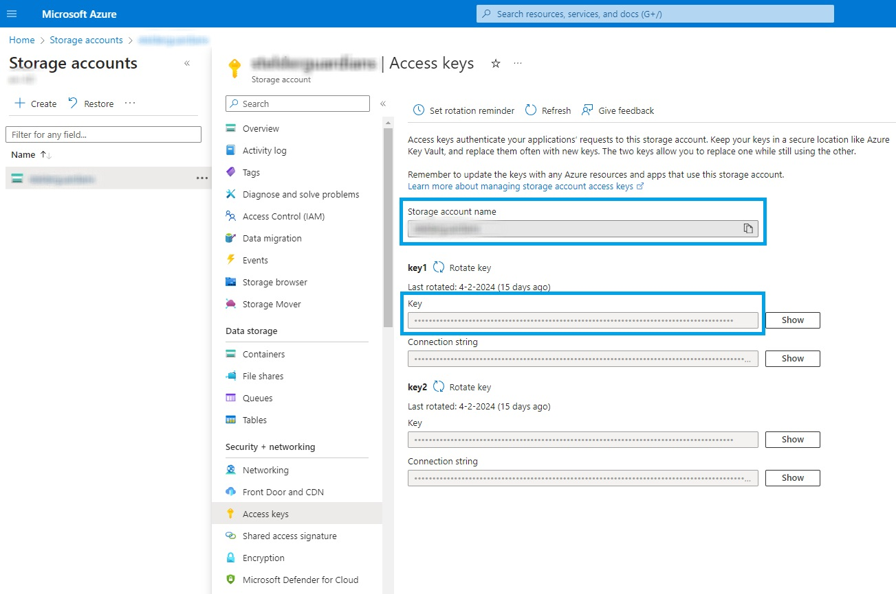
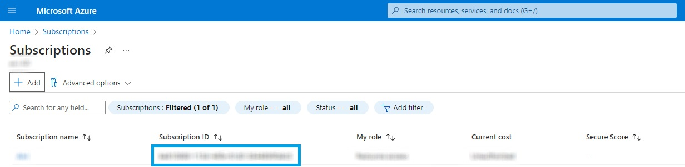
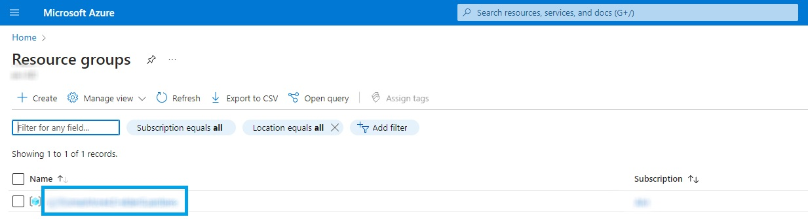

# ElderGuardians Fall Detection System

### Introduction

This is a fall detection system implemented in Python using OpenCV, MediaPipe, Azure Storage and other libraries. The system monitors a person's posture through a camera feed and sends alerts in case of a detected fall.

## Quick Start Guide

### Prerequisites

- Install azure-cli and log in with azure account

```powershell
    choco install azure-cli

    az login --tenant <tenant-id>
```

- Create a virtual environment and activate it

```cmd

    python -m venv <virtual_environment_name_here>

    ./venv/Scripts/activate

```

- Install Required Libraries: Make sure you have the necessary Python libraries installed. You can install them using the following command

```cmd

pip install -r requirements.txt

```

- Populate the necessary environment variables and rename the .env-example file to .env. We need these variables to run the [get_connection_string.py](/get_connection_string.py) script.

```.env
ACCOUNT_KEY=
AZURE_STORAGE_ACCOUNT=
AZURE_STORAGE_CONTAINER=
subscription_id=
resource_group_name=
CONNECTION_STRING=
```

`AZURE_STORAGE_ACCOUNT` is the storage account name,
`ACCOUNT_KEY` can be found in Storage Accounts > [accountname] > Access keys and
`AZURE_STORAGE_CONTAINER` can be found in the storage account under containers.


`subscription_id` can be found under Subscriptions > Subscription ID.


`resource_group_name` can be found under Resource Groups > Name.


- Navigate to [get_connection_string.py](/get_connection_string.py) and run the script. Take the output of the script and populate the CONNECTION_STRING and the remaining variables in the .env file

- Navigate to [main.py](main.py) and change the user information to the information given from the main application.

After these steps are done you can run the [main.py](main.py) script and the application will start working.

## How it works

The script continuously captures frames from the webcam, resizes them and analyses the person’s pose using the MediaPipe Pose detection model. It extracts keypoint positions such as nose, shoulders, and hips from the detected landmarks. The velocity of the nose and the centre position between the shoulders and hips is then calculated to track movement and detect falls.

The fall detection mechanism is based on the person’s nose position relative to a dynamically adjusted threshold height. If a significant downward velocity is detected and the nose crosses this threshold, the script triggers a fall detection alert. It records the fall event, captures a video buffer around the incident, and asynchronously send the video to an Azure Blob Storage container while also notifying our backend server about the fall.
